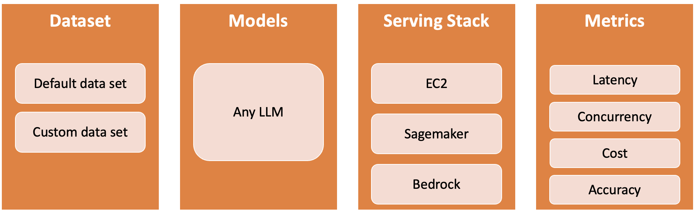

<h1 align="center">
        </img> FMBench Orchestrator
</h1>

The `FMBench Orchestrator` **automates the LLM benchmarking**. It is built with moduler design where users can plug and play with **any combination** of dataset, models, serving stacks, and benchmark metrics:  



## Try it out 
Follow the following steps and get your infrastructure cost optimization strategy for hosting Llama3.1-8b in less than 30 mins. 

#### Prerequisites

- **IAM ROLE**: You need an active AWS account having an **IAM Role** necessary permissions to create, manage, and terminate EC2 instances. See [this](docs/iam.md) link for the permissions and trust policies that this IAM role needs to have. Call this IAM role as `fmbench-orchestrator`.

- **Service quota**: Your AWS account needs to have enough **VCPU quota** to launch the Amazon EC2 instances if your LLM serving stack is EC2. In case you need to request a quota increase, please refer to [this link](https://docs.aws.amazon.com/servicequotas/latest/userguide/request-quota-increase.html). 

- **An Orchestrator EC2 Instance**: It is recommended to run the orchestrator on an EC2 instance preferably located in the same AWS region where you plan to host your LLM (although launching instances across regions is supported as well).

    - Use `Ubuntu` as the instance OS, specifically the `ubuntu/images/hvm-ssd-gp3/ubuntu-noble-24.04-amd64-server-20240927` AMI.
    - Use `t3.xlarge` as the instance type with preferably at least 100GB of disk space.
    - Associate the `fmbench-orchestrator` IAM role with this instance.


#### Install FMBench-Orchestrator on EC2

1. **Install `conda`**

    ```{.bash}
    wget https://repo.anaconda.com/miniconda/Miniconda3-latest-Linux-x86_64.sh
    bash Miniconda3-latest-Linux-x86_64.sh -b  # Run the Miniconda installer in batch mode (no manual intervention)
    rm -f Miniconda3-latest-Linux-x86_64.sh    # Remove the installer script after installation
    eval "$(/home/$USER/miniconda3/bin/conda shell.bash hook)" # Initialize conda for bash shell
    conda init  # Initialize conda, adding it to the shell
    ```

1. **Clone the Repository**

    ```bash
    git clone https://github.com/awslabs/fmbench-orchestrator.git
    cd fmbench-orchestrator
    ```

#### Conda Environment Setup

1. **Create a Conda Environment with Python 3.11**:

    ```bash
    conda create --name fmbench-orchestrator-py311 python=3.11 -y
    ```

1. **Activate the Environment**:

    ```bash
    conda activate fmbench-orchestrator-py311
    ```

1. **Install Required Packages**:

    ```bash
    pip install -r requirements.txt
    ```

1. **Hugging Face token**:
   Please follow the instructions [here](https://huggingface.co/docs/hub/security-tokens) to get a Hugging Face token.
   Please also make sure to get **access to the models in HuggingFace**. 
   Most models and tokenizers are downloaded from Hugging Face, to enable this place your Hugging Face token in `/tmp/hf_token.txt`.

   ```bash
   # replace with your Hugging Face token
   hf_token=your-hugging-face-token
   echo $hf_token > /tmp/hf_token.txt
   ```

#### Run benchmark experiments:
In this example, we compare the cost and performance of hosting Llama3.1-8b on EC2 g6e.2xlarge and g6e.4xlarge.

```bash
python main.py --config-file configs/ec2.yml
```

Here is a description of all the command line parameters that are supported by the orchestrator:

- **--config-file** - _required_, path to the orchestrator configuration file.
- **--ami-mapping-file** - _optional_, _default=ami_mapping.yml_, path to a config file containing the region->instance type->AMI mapping
- **--fmbench-config-file** - _optional_, config file to use with `FMBench`, this is used if the orchestrator config file uses the "{{config_file}}" format for specifying the `FMBench` config file. If you are benchmarking on SageMaker or Bedrock then parameter does need to be specified.
- **--infra-config-file** - _optional_, _default=infra.yml_, config file to use with AWS infrastructure
- **--write-bucket** - _optional_, _default=placeholder_, *this parameter is only needed when benchmarking on SageMaker*, Amazon S3 bucket to store model files for benchmarking on SageMaker


#### Analyze the results

To generate analysis reports from the above experiments: 

```{.bashrc}
python analytics/analytics.py --results-dir results/llama3-8b-g6e --model-id llama3-8b --payload-file payload_en_3000-3840.jsonl --latency-threshold 2
```
The results are saved in `fmbench-orchestrator/analytics/results/llama3-8b-g6e/` on your orchestrator EC2 instance, including summarization of the results, a heatmap that helps understand which instance type gives the best price performance at the desired scale (transactions/minute), etc.
Below is one of the output tables about cost comparison. 


## How do I ...
The experiment configurations are specified in the config YML file, in the `instances` section. FMbench Orchestrator will run each experiment in parallel, and then collect the results from each experiment onto the orchestrator EC2 instance. See [configuration guide](docs/config_guide.md) for details on the orchestrator config file.

### Run cost / performance comparison between different types of EC2 instances
See [`configs/ec2.yml`](configs/ec2.yml) as an example for EC2 experiments. The `instances` section has 2 experiments, one using g6e.2xlarge and the other using g6e.4xlarge. 

```{.yml}
instances:
- instance_type: g6e.2xlarge
  <<: *ec2_settings    
  fmbench_config: 
  - fmbench:llama3/8b/config-ec2-llama3-8b-g6e-2xlarge.yml

- instance_type: g6e.4xlarge
  <<: *ec2_settings
  fmbench_config: 
  - fmbench:llama3/8b/config-llama3-8b-g6e.4xl-tp-1-mc-max-djl-ec2.yml
```

Note that the  [`fmbench: lama3/8b/config-ec2-llama3-8b-g6e-2xlarge.yml`](https://github.com/aws-samples/foundation-model-benchmarking-tool/blob/main/src/fmbench/configs/llama3/8b/config-ec2-llama3-8b-g6e-2xlarge.yml) and [`fmbench: llama3/8b/config-llama3-8b-g6e.4xl-tp-1-mc-max-djl-ec2.yml`](https://github.com/aws-samples/foundation-model-benchmarking-tool/blob/main/src/fmbench/configs/llama3/8b/config-llama3-8b-g6e.4xl-tp-1-mc-max-djl-ec2.yml) files are default config files provided in the [FMbench repo](https://github.com/aws-samples/foundation-model-benchmarking-tool). FMbench orchestrator use these config to launch EC2 instance and deploy the expements on the launched EC2 instance. 

An example of using customized `fmbench` config file is given in the [Compare SageMaker against EC2](#compare-sagemaker-against-ec2) section below. 


### Run cost / performance comparison between SageMaker and EC2
LLM can be hosted on an [SageMaker endpoint](https://docs.aws.amazon.com/sagemaker/latest/dg/how-it-works-deployment.html). This experiment requires the SageMaker endpoint already deployed.

You first need to write a `FMBench` config file for SageMaker. One option is to make a copy of [`config-llama3-8b-inf2-48xl-tp=8-bs=4-byoe.yml`](https://github.com/aws-samples/foundation-model-benchmarking-tool/blob/main/src/fmbench/configs/llama3/8b/config-llama3-8b-inf2-48xl-tp%3D8-bs%3D4-byoe.yml), and modify the values in the `experiments` section, such as the `endpoint_name`, `instance_type` and `model_id`. Then upload the edited config to your orchestrator EC2 instance. 

The orchestrator config YML file should have the following:

```{.yml}
instances:
- instance_type: m7a.xlarge   # SageMaker experiment 
  <<: *ec2_settings
  fmbench_config: 
  - PATH/TO/YOUR/edited_config.yml 
  
- instance_type: g6e.2xlarge  # EC2 experiment 
  <<: *ec2_settings    
  fmbench_config: 
  - fmbench:llama3/8b/config-ec2-llama3-8b-g6e-2xlarge.yml

```


### Run cost / performance comparison between Bedrock and SageMaker 
See [`configs/bedrock.yml`](configs/bedrock.yml) as an example for Bedrock experiments. 

```{.yml}
instances:
- instance_type: m7a.xlarge   # Bedrock experiment 
  <<: *ec2_settings
  fmbench_config: 
  - fmbench:bedrock/config-bedrock-llama3-1.yml

- instance_type: m7a.xlarge   # SageMaker experiment 
  <<: *ec2_settings
  fmbench_config: 
  - ~/fmbench-orchestrator/configs/byoe/config-llama3-8b-inf2-48xl-tp=8-bs=4-byoe.yml
```

The `FMBench` config file for Bedrock is [`fmbench:bedrock/config-bedrock-llama3-1.yml`](https://github.com/aws-samples/foundation-model-benchmarking-tool/blob/main/src/fmbench/configs/bedrock/config-bedrock-llama3-1.yml). You can also customize this config and upload your .yml file to the orchestrator EC2 instance. 

### Use custom datasets
Please see [`ec2_custom_dataset.yml`](configs/ec2_custom_dataset.yml) for an example config file. The custom data is uploaded to the `~/fmbench-orchestrator/byo_dataset` folder on the orchestrator EC2 instance, specified in the `upload_files` section.  

```{.yml}
instances:
- instance_type: g6e.2xlarge
  <<: *ec2_settings
  fmbench_config: 
  - /home/ubuntu/fmbench-orchestrator/byo_fmbench_configs/config-ec2-llama3-8b-g6e-2xlarge_eval.yml
  upload_files:
  - local: byo_dataset/custom.jsonl       ## your custom dataset
    remote: /tmp/fmbench-read/source_data/
  - local: analytics/pricing.yml
    remote: /tmp/fmbench-read/configs/
```
### Compare the accuracy when predicting on custom dataset
FMBench-orchestrator supports for evaluating candidate models using Majority Voting with a Panel of LLM Evaluators (PoLL). Before running the experiment, please enable **model access** in Bedrock to the judge models: **Llama3-70b**, **Cohere command-r-v1** and **claude 3 Sonnet**. 

First, createa a config file specifying accuracy measurement related info, such as `ground_truth`,  `question_col_key`. You can copy [config-llama3.1-8b-g5.2xl-g5.4xl-sm.yml](https://github.com/aws-samples/foundation-model-benchmarking-tool/blob/e82810862e8dd21e4914d925c4be7bf0be9f6afe/src/fmbench/configs/llama3.1/8b/config-llama3.1-8b-g5.2xl-g5.4xl-sm.yml) as an example, and modify based on your experiment. 

Here are the parameters to update in this config file:

```{.yml}
run_steps:
    0_setup.ipynb: yes
    1_generate_data.ipynb: yes
    2_deploy_model.ipynb: yes
    3_run_inference.ipynb: yes
    4_get_evaluations.ipynb: yes     # Make sure to set this step to "yes".
    5_model_metric_analysis.ipynb: yes
    6_cleanup.ipynb: yes

datasets:
  prompt_template_keys:
  - input
  - context
  ground_truth_col_key: answers      # The name of the answer filed in your custom data 
  question_col_key: input            # The name of the question field in your custom data 

```


### Provide a custom prompt/custom tokenizer for my benchmarking test

The `instances` section has an `upload_files` section for each instance where we can provide a list of `local` files and `remote` directory paths to place any custom file on an EC2 instance. This could be a `tokenizer.json` file, a custom prompt file, or a custom dataset. The example below shows how to upload a custom `pricing.yml` and a custom dataset to an EC2 instance.

```{.bashrc}
instances:
- instance_type: g6e.2xlarge
  <<: *ec2_settings
  fmbench_config: 
  - fmbench:llama3/8b/config-ec2-llama3-8b-g6e-2xlarge.yml
  upload_files:
   - local: byo_dataset/custom.jsonl
     remote: /tmp/fmbench-read/source_data/
   - local: analytics/pricing.yml
     remote: /tmp/fmbench-read/configs/
```

See [`ec2_llama3.2-1b-cpu-byodataset.yml`](configs/ec2_llama3.2-1b-cpu-byodataset.yml) for an example config file. This file refers to the [`synthetic_data_large_prompts`](byo_dataset/synthetic_data_large_prompts.jsonl) and a custom prompt file [`prompt_template_llama3_summarization.txt`](byo_dataset/prompt_template_llama3_summarization.txt) for a summarization task. You can edit the dataset file and the prompt template as per your requirements.

### Benchmark multiple config files on the same EC2 instance

Often times we want to benchmark different combinations of parameters on the same EC2 instance, for example we may want to test tensor parallelism degree of 2, 4 and 8 for say `Llama3.1-8b` model on the same EC2 machine say `g6e.48xlarge`. Can do that easily with the orchestrator by specifying a list of config files rather than just a single config file as shown in the following example:

   ```{.bashrc}
  fmbench_config: 
  - fmbench:llama3.1/8b/config-llama3.1-8b-g6e.48xl-tp-2-mc-max-djl.yml
  - fmbench:llama3.1/8b/config-llama3.1-8b-g6e.48xl-tp-4-mc-max-djl.yml
  - fmbench:llama3.1/8b/config-llama3.1-8b-g6e.48xl-tp-8-mc-max-djl.yml
  ```
The orchestrator would in this case first run benchmarking for the first file in the list, and then on the same EC2 instance run benchmarking for the second file and so on and so forth. The results folders and `fmbench.log` files for each of the runs is downloaded at the end when all config files for that instance have been processed.


## In case you are curious 

Below is the conceptual architecture of the FMBench Orchestrator. 


## Security

See [CONTRIBUTING](CONTRIBUTING.md#security-issue-notifications) for more information.

## License

This project is licensed under the MIT-0 License - see the [LICENSE](LICENSE) file for details.

## Contributing
Contributions are welcome! Please fork the repository and submit a pull request with your changes. For major changes, please open an issue first to discuss what you would like to change.


