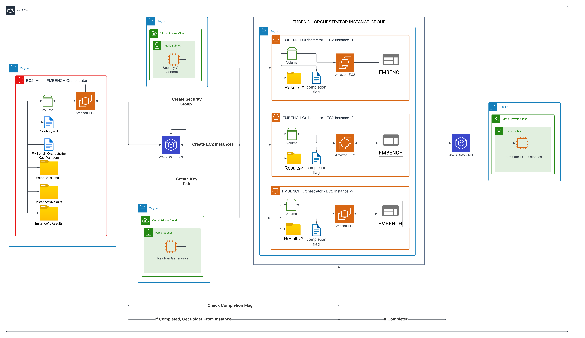

# FMBench Orchestrator



## Overview

The **FMBench Orchestrator** is a tool designed to automate the deployment and management of FMBENCH on multiple EC2 instances in the AWS cloud. This orchestrator automates the creation of Security Groups, Key Pairs, EC2 instances, runs FMBENCH for a specific config, retrieves the results, and shuts down the instances after completion. It simplifies the benchmarking process and ensures a streamlined and scalable workflow.

## Table of Contents
1. [Prerequisites](#prerequisites)
2. [Installation](#installation)
3. [Conda Environment Setup](#conda-environment-setup)
4. [Configuration](#configuration)
5. [Usage](#usage)
6. [Workflow](#workflow)
7. [Cleaning Up](#cleaning-up)
8. [Contributing](#contributing)
9. [License](#license)

## Prerequisites
- **IAM ROLE**: You need an active AWS account having an **IAM Role** necessary permissions to create, manage, and terminate EC2 instances.
- **EC2 Instance**: It is recommended to run the orchestrator on an EC2 instance, attaching the IAM Role with permissions, located in the same AWS region where you plan to launch the multiple EC2 instances.


## Installation
1. **Clone the Repository**:
    ```bash
    git clone https://github.com/yourusername/fmbench-orchestrator.git
    cd fmbench-orchestrator
    ```

## Conda Environment Setup
1. **Create a Conda Environment with Python 3.11**:
    ```bash
    conda create --name fmb-py311 python=3.11
    ```

2. **Activate the Environment**:
    ```bash
    conda activate fmb-py311
    ```

3. **Install Required Packages**:
    ```bash
    pip install -r requirements.txt
    ```

## Running FMBench Orchestrator:
```bash
python main.py
```

# FMBENCH Orchestrator Configuration Guide

## Overview
This configuration file is used to manage the deployment and orchestration of multiple EC2 instances for running FMBENCH benchmarks. The file defines various parameters, including AWS settings, run steps, security group settings, key pair management, and instance-specific configurations. This guide explains the purpose of each section and provides details on how to customize the file according to your requirements.

## Configuration Sections

### AWS Settings
This section contains the basic settings required to interact with AWS services.

- `region`: Specifies the AWS region where the EC2 instances will be launched. Ensure this is set to the region where you want to deploy your resources (e.g., `us-east-1`).
- `iam_instance_profile_arn`: The Amazon Resource Name (ARN) of the IAM instance profile that will be attached to the EC2 instances. This profile should have the necessary permissions for the orchestrator's operations.
- `hf_token_fp`: Your Hugging Face token for accessing specific resources or APIs. Replace `{hf_token_fp_here}` with your actual Hugging Face token filepath.

### Run Steps
Defines the various steps in the orchestration process. Set each step to `yes` or `no` based on whether you want that step to be executed.

- `security_group_creation`: Whether to create a new security group for the EC2 instances. Set to `yes` to create a new security group or `no` to use an existing one.
- `key_pair_generation`: Whether to generate a new key pair for accessing the EC2 instances. If set to `no`, ensure you have an existing key pair available.
- `deploy_ec2_instance`: Whether to deploy the EC2 instances as specified in the `instances` section.
- `run_bash_script`: Whether to run a startup script on each EC2 instance after deployment.
- `delete_ec2_instance`: Whether to terminate the EC2 instances after completing the benchmarks.

### Security Group
This section configures the security group settings for the EC2 instances.

- `group_name`: Name of the security group to be created or used. If a group with this name already exists, it will be used.
- `description`: A brief description of the security group, such as "MultiDeploy EC2 Security Group."
- `vpc_id`: The VPC ID where the security group will be created. Leave this blank to use the default VPC.

### Key Pair Management
Manages the SSH key pair used for accessing the EC2 instances.

- `key_pair_name`: Name of the key pair to be created or used. If `key_pair_generation` is set to `no`, ensure this matches the name of an existing key pair.
- `key_pair_fpath`: The file path where the key pair file (`.pem`) will be stored locally. Update this path if you have an existing key pair.

### Instances
Defines the EC2 instances to be launched for running the benchmarks. This section can contain multiple instance configurations.

- `instance_type`: The type of EC2 instance to be launched (e.g., `g5.2xlarge`). Choose based on your resource requirements.
- `ami_id`: The Amazon Machine Image (AMI) ID to use for the instance. Different AMIs can be specified for different instance types.
- `startup_script`: Path to the startup script that will be executed when the instance is launched. This script should be stored in the `startup_scripts` directory.
- `post_startup_script`: Path to a script that will be executed after the initial startup script. Use this for any additional configuration or benchmark execution commands.
- `fmbench_config`: URL or file path to the FMBENCH configuration file that will be used by the orchestrator.

### Example Instance Configuration
The following is an example configuration for deploying a `g5.2xlarge` and `g5.12xlarge` instance with specific AMI (Ubuntu Deep Learning OSS) and startup scripts:

**Note:** This example uses html link for one, and local filepath for the other.

```yaml
instances:
- instance_type: {instance_name_here}
  region: {region_here}
  ami_id: {ami_id_here}
  device_name: /dev/sda1
  ebs_del_on_termination: True | False
  ebs_Iops: 16000
  ebs_VolumeSize: {Volume_Size_Here}
  ebs_VolumeType: {Volume_type_Here}
  #Defaults to none, You can use either Reservation Id ARN or both
  CapacityReservationPreference: open | none
  CapacityReservationId: {The ID of the Capacity Reservation in which to run the instance.}
  CapacityReservationResourceGroupArn: {The ARN of the Capacity Reservation resource group in which to run the instance.}
  startup_script: startup_scripts/gpu_ubuntu_startup.txt
  post_startup_script: post_startup_scripts/fmbench.txt
  fmbench_llm_tokenizer_fp: fmbench_llm_utils/tokenizer.json
  fmbench_llm_config_fp: fmbench_llm_utils/config.json
  fmbench_tokenizer_remote_dir: /tmp/fmbench-read/llama3_tokenizer/
  # Timeout period in Seconds before a run is stopped
  fmbench_complete_timeout: 1200
  fmbench_config: {fmbench_config_here}

```

## Customization
1. **AWS Settings**: Ensure that the `region` and `iam_instance_profile_arn` are set according to your AWS account and region.
2. **Run Steps**: Toggle the steps based on your requirements. If you have an existing key pair or security group, set the respective steps to `no`.
3. **Security Group**: Update the `vpc_id` if you have a specific VPC. Otherwise, if left blank the default VPC will be used.
4. **Key Pair Management**: If you choose not to generate a new key pair, ensure the existing key pair is specified and stored in the specified path and registered with aws.
5. **Instances**: Modify the instance configurations as per your benchmarking requirements. Ensure the AMI ID and instance type are available in the chosen region.


## Workflow
1. **Initialization**: Reads the configuration file and initializes the necessary AWS resources.
2. **Instance Creation**: Launches the specified number of EC2 instances with the provided configuration.
3. **FMBENCH Execution**: Runs the FMBENCH benchmark script on each instance.
4. **Results Collection**: Collects the results from each instance and uploads them to the specified S3 bucket.
5. **Instance Termination**: Terminates all instances to prevent unnecessary costs.

## Cleaning Up

Cleanup is done automatically. But if you select **no** in config, you would have to manually terminate the instances from EC2 console.


## Contributing
Contributions are welcome! Please fork the repository and submit a pull request with your changes. For major changes, please open an issue first to discuss what you would like to change.


## Security

See [CONTRIBUTING](CONTRIBUTING.md#security-issue-notifications) for more information.

## License

This project is licensed under the MIT-0 License - see the [LICENSE](LICENSE) file for details.


